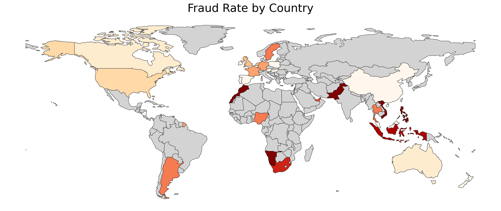
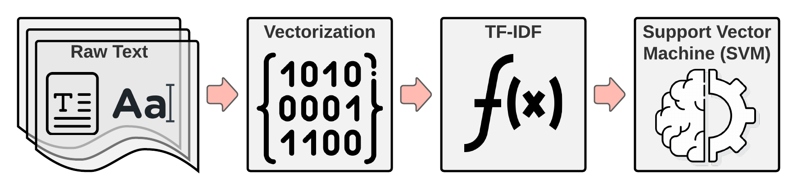
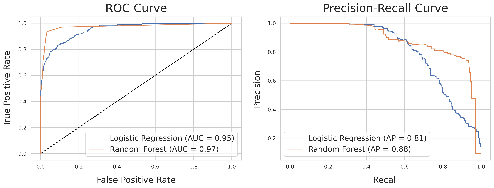

# Fraud Detection

## Table of Contents
* [Introduction](#Introduction)
* [Data Processing](#Data-Processing)
* [Data Analysis (EDA)](#Data-Analysis-(EDA))
* [NLP Feature Engineering](#NLP-Feature-Engineering)
* [Machine Learning](#Machine-Learning)
    * [Model Setup](#Model-Setup)
    * [Model Selection and Results](#Model-Selection-and-Results)
* [Production and Deployment](#Production-and-Deployment)

 

# Introduction

Fraud is a major concern for any company. The goal of this project is to create a system that monitors event transactions to accurately detect fraudulent events and present the results of the fraud predictions in a easy to use user interface.

## The Dataset

The data provided by the company was reasonably complete, although complex. This data contained a mix of categorical and numerical data in varied formats including html, datetime objects, lists of dictionaries, along with normal text and numerical values.

The first step on our exploration was to split the data into fraudulent and not fraudulent transactions. The acct_type feature provided was condensed to give us a fraudulent record count of 1033 and a non-fraudulent record count of 10436 in our training data.

# Data Processing

The data cleaning process consisted of five main steps:
1. Convert Datatypes
    * Convert unix timestamps to datetime objects
    * Convert yes/no (y/n) strings to boolean values (1, 0)
2. Deal With Nan/Null Values
    * This was a little more complicated than I thought at first glance. I tried to keep as much of the data as possible so I replaced nulls with either -1 or Unknown.
    * There was a lot of features that had empty strings which aren't immediately recognized as nan/null values. I located these and replace them with 'Unknown'.
    * The amount of nan/null values was a solid predictor of fraud so it was a good thing not to simply drop any data with nan/nulls.
3. Remove Unnecessary or Unusable Features
    * Some features provided no value or overlapped with other features.
    * Some features caused data leakage for the modeling process.
4. Condense and aggregate nested features (list of previous payouts and dicts of ticket information).
5. Convert html features into plain text using the Beautiful Soup library.

 

# Data Analysis (EDA)

## Number of Missing Values

Exploration of the data showed that multiple features had different common values for fraudulent events than non-fraudulent events. One interesting marker of a fraudulent events is that the user that created the event provided less information about it. As you can see below fraudulent events are more likely to have more missing information.

## Fraud Rate by Country

The location of an event has a lot of predictive value on whether or not the event is fraudulent. I grouped the events by country because it was fairly quick and provided some interesting comparisons between locations.

### Major Locations

The majority of events take place in just four countries but there is a large difference in the fraud rate between each country. For example the fraud rate in the United Kingdom is over twice that of the US and almost ten times the fraud rate of Australia. An unknown location is one of the best indicators of fraud. 

|Location|Fraud Rate|Total Events|Fraud Count|Non-Fraud Count|
|:-------|:--------:|:----------:|:---------:|:-------------:|
|Overall|**9.1%**|11469|1040|10429|
|United States|**5.7%**|6706|383|1066|
|United Kingdom|**11.9%**|1536|183|1353|
|Canada|**2.2%**|916|20|896|
|Australia|**1.3%**|550|7|543|
|Rest of the World|**18.3%**|453|83|370|
|Unknown Location|**25.5%**|1430|364|1066|

### Minor Locations

Outside of the major countries there is a lot of interesting variablity in fraud rates. While the overall fraud rate is high in the countries with less events, the rate can vary dramaticaly from country to country as is shown below. This variablity is useful for creating a model that can predict fraud.

|Location|Fraud Rate|Total Events|Fraud Count|Non-Fraud Count|
|:-------|:--------:|:----------:|:---------:|:-------------:|
|Overall|**9.1%**|11469|1040|10429|
|**Low Fraud Countries**|||||
|New Zealand|**0%**|47|0|47|
|Ireland|**0%**|39|0|39|
|**High Fraud Countries**|||||
|Morocco|**100%**|15|15|0|
|Philippines|**100%**|11|11|0|

 

# NLP Feature Engineering

A few of the original data features consisted of text that needed to be explored and processed into a usable format for modeling. These text features contained some of the most useful information so I utilized some NLP modeling techniques to turn the raw text into probabilities of an event being fraudulent or not. These probabilities are then combined with the other data features for use in the main machine learning model. 

Four text features were utilized:
1. Event Name
2. Event Description
3. Organization Name
4. Organization Description
As you can see from the below examples, there are some interesting differences between which words appear in fraudulent events compared to non-fraudulent events.

### Event Name

### Event Description

 

# Machine Learning

## Model Setup

In order to ensure that the modeling process provided accurate and relavent results the following model preparation steps were crucial to the process.

### Metric Selection

The current estimate is that only 10% of events are fraudulent. This creates a situation where it is fairly easy to get a high accuracy (>90%) but this does not necessarily mean that the system is successful. The main goal is to detect as many of the fraudulent events (true positives) as possible. With this in mind, recall is the metric that will be the main focus, though other metrics (Accuracy, Precision, F1-Score) will not be completely ignored. 

### Data Integrity

Multiple steps were taken to ensure that there is no data leakage throughout the system. A cross validation system was used for model tuning with the main working dataset. A separate dataset was used for testing. A third holdout dataset is also available for further testing to ensure data integrity. Each of these datasets were created using random sampling from the original data before any processing was completed.

### Model Tuning

A grid search cross validation process was used to locate the optimal hyperparameters for each of the model types.

## Model Selection and Results

Multiple models were tested to determine which provided the best predictions.
While multiple metrics can be useful, in this case the focus will be on two central metrics.
1. **Overall Model Accuracy** - Percentage of predictions that the model got correct. Baseline is 90%.
2. **Fraud Specific Recall** - Percentage of fraudulent events that the model identified as fraud. Baseline is 0%.
The Baseline is created from predicting the majority class (non-fraudulent) for each event. 

### Logistic Regression

**Overall Model Accuracy: 95%**  
**Fraud Specific Recall: 52%**

### Random Forest Classifier

**Overall Model Accuracy: 96%**  
**Fraud Specific Recall: 59%**

## Model Comparisons

Below is a comparison of the best results for the tested models.

# Production and Deployment

Flask web app to allow users to analyze and interact with fraud records and prediction results.

[Link to live app on AWS](ec2-34-223-178-205.us-west-2.compute.amazonaws.com)

[Link to live dashboard on Google Data Studio](https://datastudio.google.com/reporting/1e1a7bc5-9de7-4f7e-9602-3518450e616d)

