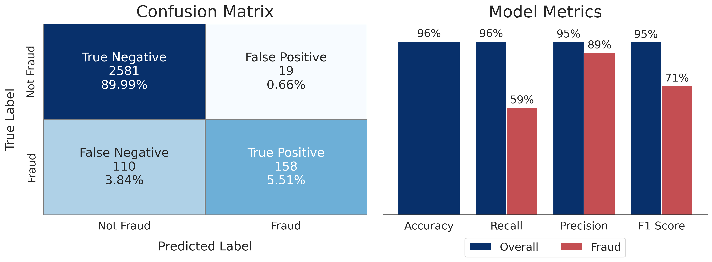
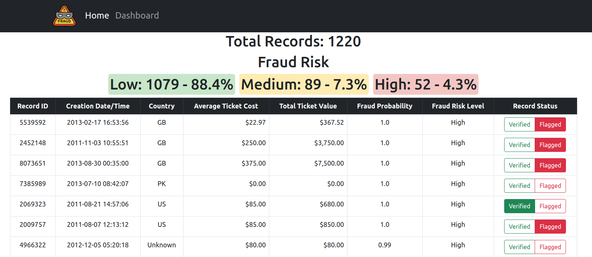
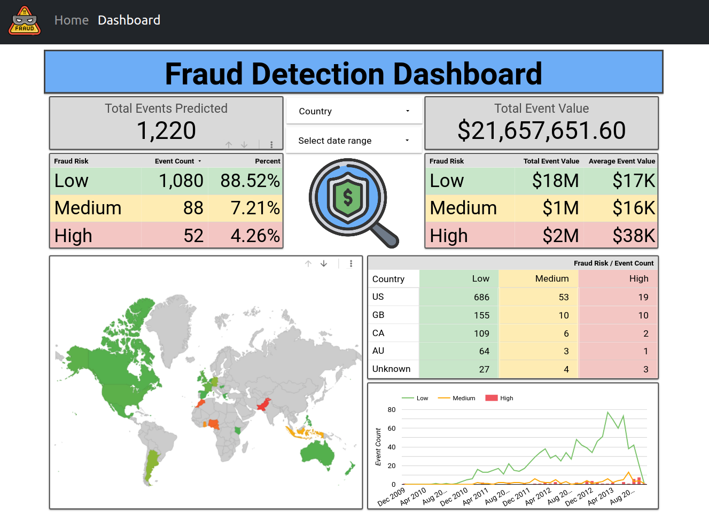

# Fraud Detection

## Table of Contents
* [Introduction](#Introduction)
* [Data Processing](#Data-Processing)
* [Data Analysis (EDA)](#Data-Analysis-(EDA))
* [NLP Feature Engineering](#NLP-Feature-Engineering)
* [Machine Learning](#Machine-Learning)
    * [Model Setup](#Model-Setup)
    * [Model Selection and Results](#Model-Selection-and-Results)
* [Production and Deployment](#Production-and-Deployment)
* [Setup and Usage](#Setup-and-Usage)

<br/>

# Introduction

Fraud is a major concern for any company. The goal of this project is to create a system that monitors event transactions to accurately detect fraudulent events and present the results of the fraud predictions in a easy to use user interface.

## The Dataset

The data provided by the company was reasonably complete, although complex. This data contained a mix of categorical and numerical data in varied formats including html, datetime objects, lists of dictionaries, along with normal text and numerical values.

The first step on our exploration was to split the data into fraudulent and not fraudulent transactions. The acct_type feature provided was condensed to give us a fraudulent record count of 1,293 and a non-fraudulent record count of 13,044 across the full dataset (14,337 total records, ~9% fraud rate).

# Data Processing


The data cleaning process consisted of five main steps:
1. Convert Datatypes
    * Convert unix timestamps to datetime objects
    * Convert yes/no (y/n) strings to boolean values (1, 0)
2. Deal With Nan/Null Values
    * This was a little more complicated than I thought at first glance. I tried to keep as much of the data as possible so I replaced nulls with either -1 or Unknown.
    * There was a lot of features that had empty strings which aren't immediately recognized as nan/null values. I located these and replace them with 'Unknown'.
    * The amount of nan/null values was a solid predictor of fraud so it was a good thing not to simply drop any data with nan/nulls.
3. Remove Unnecessary or Unusable Features
    * Some features provided no value or overlapped with other features.
    * Some features caused data leakage for the modeling process.
4. Condense and aggregate nested features (list of previous payouts and dicts of ticket information).
5. Convert html features into plain text using the Beautiful Soup library.

<br/>

# Data Analysis (EDA)

## Number of Missing Values

Exploration of the data showed that multiple features had different common values for fraudulent events than non-fraudulent events. One interesting marker of a fraudulent events is that the user that created the event provided less information about it. As you can see below fraudulent events are more likely to have more missing information.


## Fraud Rate by Country

The location of an event has a lot of predictive value on whether or not the event is fraudulent. I grouped the events by country because it was fairly quick and provided some interesting comparisons between locations.


### Major Locations

The majority of events take place in just four countries but there is a large difference in the fraud rate between each country. For example the fraud rate in the United Kingdom is over twice that of the US and almost ten times the fraud rate of Australia. An unknown location is one of the best indicators of fraud. 

|Location|Fraud Rate|Total Events|Fraud Count|Non-Fraud Count|
|:-------|:--------:|:----------:|:---------:|:-------------:|
|Overall|**9.1%**|11469|1040|10429|
|United States|**5.7%**|6706|383|1066|
|United Kingdom|**11.9%**|1536|183|1353|
|Canada|**2.2%**|916|20|896|
|Australia|**1.3%**|550|7|543|
|Rest of the World|**18.3%**|453|83|370|
|Unknown Location|**25.5%**|1430|364|1066|

### Minor Locations

Outside of the major countries there is a lot of interesting variablity in fraud rates. While the overall fraud rate is high in the countries with less events, the rate can vary dramaticaly from country to country as is shown below. This variablity is useful for creating a model that can predict fraud.

|Location|Fraud Rate|Total Events|Fraud Count|Non-Fraud Count|
|:-------|:--------:|:----------:|:---------:|:-------------:|
|Overall|**9.1%**|11469|1040|10429|
|**Low Fraud Countries**|||||
|New Zealand|**0%**|47|0|47|
|Ireland|**0%**|39|0|39|
|**High Fraud Countries**|||||
|Morocco|**100%**|15|15|0|
|Philippines|**100%**|11|11|0|

<br/>

# NLP Feature Engineering


A few of the original data features consisted of text that needed to be explored and processed into a usable format for modeling. These text features contained some of the most useful information so I utilized some NLP modeling techniques to turn the raw text into probabilities of an event being fraudulent or not. These probabilities are then combined with the other data features for use in the main machine learning model. 

Four text features were utilized:
1. Event Name
2. Event Description
3. Organization Name
4. Organization Description
As you can see from the below examples, there are some interesting differences between which words appear in fraudulent events compared to non-fraudulent events.

### Event Name


### Event Description


<br/>

# Machine Learning

## Model Setup

In order to ensure that the modeling process provided accurate and relavent results the following model preparation steps were crucial to the process.

### Metric Selection

The dataset has approximately 9% fraud rate across all records (9.6% in training data, 4.4% in test data). This creates a situation where it is fairly easy to get a high accuracy (>90%) by simply predicting all events as non-fraudulent, but this does not mean the system is successful. The main goal is to **detect as many of the fraudulent events (true positives) as possible**. With this in mind, **recall** is the metric that will be the main focus, though other metrics (Accuracy, Precision, F1-Score) will not be completely ignored.

**Threshold Optimization:** The production system uses a **dual-threshold approach** to maximize fraud detection:
- **High risk**: Fraud probability ≥ 0.10
- **Medium risk**: Fraud probability ≥ 0.03 and < 0.10
- Both High and Medium risk events are flagged for review

This creates an **effective threshold of 0.03**, catching **92.9% of fraudulent events** with 25.7% precision and 12.4% false positive rate. The system prioritizes the business goal of detecting nearly all fraud over minimizing false alarms - flagged events undergo manual review before action is taken. 

### Data Integrity

Multiple steps were taken to ensure that there is no data leakage throughout the system. The original dataset (14,337 records) was split chronologically into three sets:
- **Train set** (60%, 8,602 records): 2007-mid 2013 data for model training
- **Test set** (20%, 2,867 records): Mid-2013 data for validation 
- **Simulate set** (20%, 2,868 records): Late-2013 data for webapp demonstration

This chronological split ensures the model is tested on future data it hasn't seen, mimicking real-world deployment where the model predicts future fraud events. A cross validation system was used for model tuning with the training dataset.

### Model Tuning

A grid search cross validation process was used to locate the optimal hyperparameters for each of the model types.

## Model Selection and Results

Multiple models were tested to determine which provided the best predictions.
While multiple metrics can be useful, in this case the focus will be on two central metrics.
1. **Overall Model Accuracy** - Percentage of predictions that the model got correct. Baseline is 90%.
2. **Fraud Specific Recall** - Percentage of fraudulent events that the model identified as fraud. Baseline is 0%.
The Baseline is created from predicting the majority class (non-fraudulent) for each event. 

### Logistic Regression

**Overall Model Accuracy: 95%**  
**Fraud Specific Recall: 52%**


### Random Forest Classifier

**Overall Model Accuracy: 95.9%**  
**Fraud Specific Recall: 92.9%** (dual-threshold approach)  
**Fraud Specific Precision: 25.7%**  
**F1-Score: 0.403**  
**False Positive Rate: 12.4%**

The Random Forest model uses a **dual-threshold system** to maximize fraud detection in alignment with the primary business goal. Events with fraud probability ≥0.10 are marked "High risk" and events ≥0.03 are marked "Medium risk" - both categories are flagged for review. This approach catches **92.9% of all fraudulent events** (118 out of 127), missing only 9. The 12.4% false positive rate (1 in 8 legitimate events flagged) is an acceptable tradeoff given that flagged events undergo manual review before action is taken.



## Model Comparisons

Below is a comparison of the best results for the tested models.


# Production and Deployment

Flask web app to analyze and interact with fraud records and prediction results.





---

## Setup and Usage

### Prerequisites
- Python 3.9+
- Git

### Installation

```bash
# Clone the repository
git clone https://github.com/jeffjohannsen/Fraud_Detection.git
cd Fraud_Detection

# Download the full dataset from Releases (optional - required for retraining)
# Go to https://github.com/jeffjohannsen/Fraud_Detection/releases
# Download data.json (239 MB) and place in data/raw/
# Download train_data.json (164 MB) and test_data.json (44 MB) and place in data/processed/
# Note: simulate_data.json is included in the repo for webapp demo

# Create virtual environment
python3 -m venv venv
source venv/bin/activate  # On Windows: venv\Scripts\activate

# Install dependencies
pip install -r requirements.txt

# Initialize database with historical records
python src/database/init.py
```

### Running the Application

```bash
# From project root
python run_app.py
```

Access the app at http://127.0.0.1:5000

### Available Endpoints
- `/` - Home page with recent predictions
- `/simulate` - Simulate fraud detection on random events
- `/score` - API endpoint for scoring events (POST)

### Project Structure
```
data/
├── raw/          # Original datasets
├── processed/    # Cleaned, feature-engineered data
├── databases/    # SQLite database (generated)
└── predictions/  # Model outputs

models/           # Trained ML models (.pkl files)

notebooks/
├── exploratory_data_analysis.ipynb  # EDA with geographic visualizations
├── model_development.ipynb          # Model training & comparison
└── wordcloud_creation.ipynb         # Text feature visualization

src/
├── data/
│   ├── preprocessing.py    # Data cleaning and feature engineering
│   ├── nlp_features.py     # NLP text feature processing
│   └── holdout.py          # Train/test split utilities
├── modeling/
│   └── train.py            # Model retraining script
├── database/
│   ├── db.py               # SQLite database adapter
│   └── init.py             # Database initialization
├── scoring/
│   └── predict.py          # Real-time event scoring
└── webapp/
    ├── app.py              # Flask web application
    ├── static/             # CSS, JS, images
    └── templates/          # HTML templates
```

### Retraining Models

```bash
python src/modeling/train.py
```

This will retrain all 5 models (4 NLP pipelines + Random Forest) using current scikit-learn version.